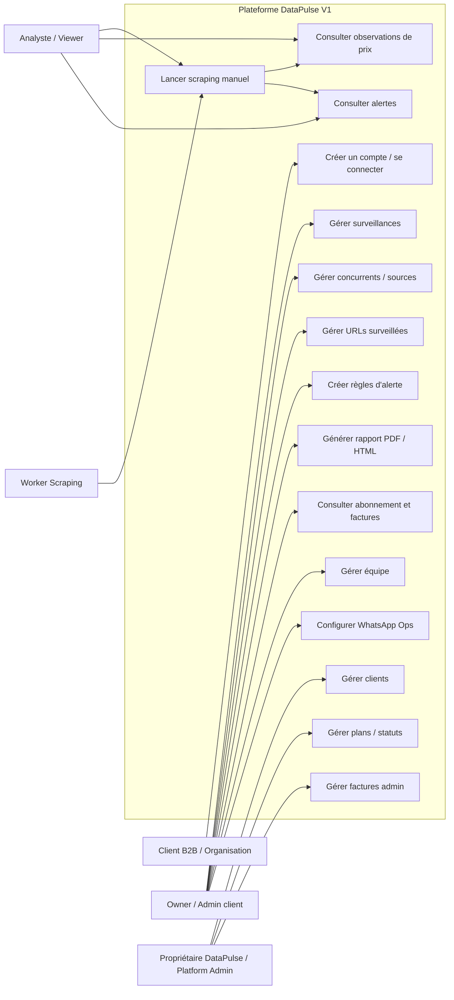
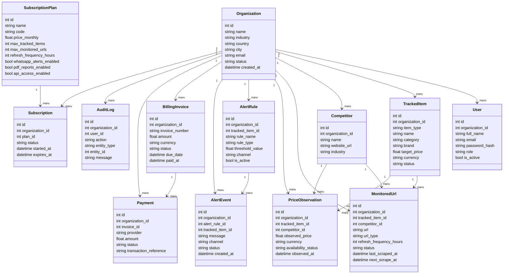
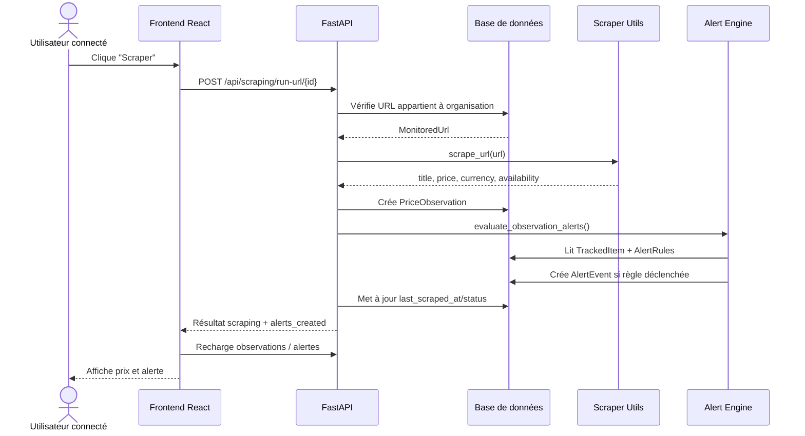
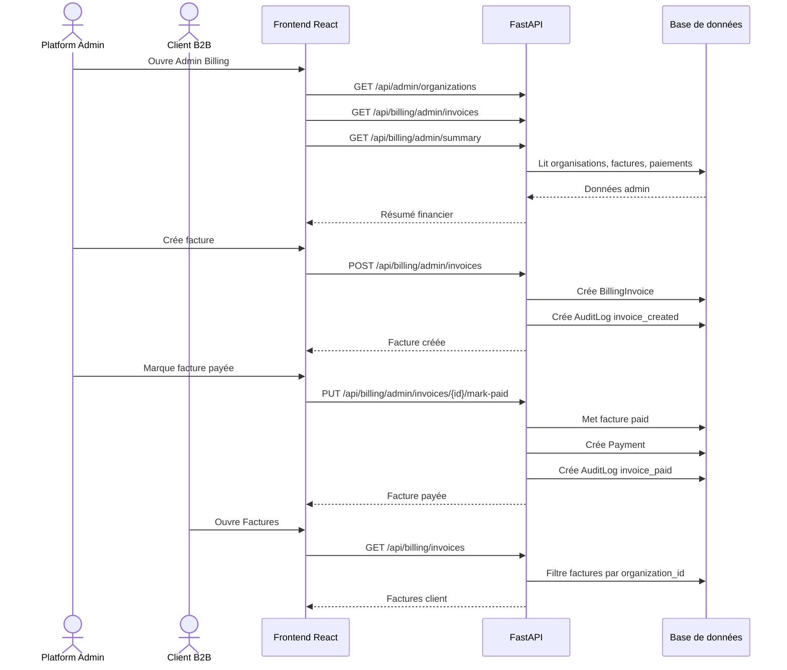
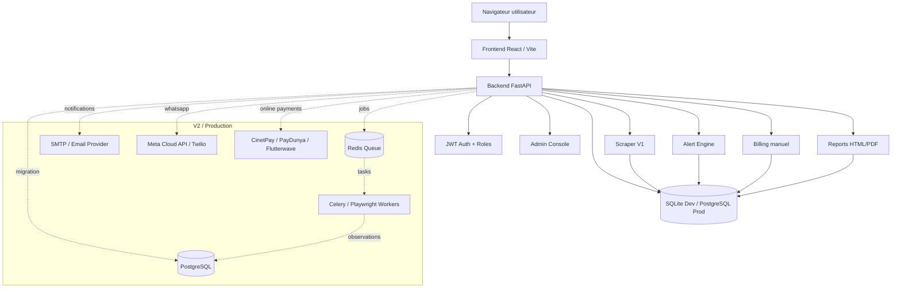

# DataPulse V1 — Diagrammes UML et architecture

Ce document décrit la version V1 présentable de DataPulse.

## 1. Use Case Diagram

## 2. Class Diagram

## 3. Sequence Diagram — Scraping

## 4. Sequence Diagram — Abonnement / Facturation

## 5. Architecture Diagram

## 6. Périmètre V1 présentable

- Authentification et inscription
- Multi-tenant par organisation
- Gestion surveillances
- Gestion concurrents et URLs
- Scraping manuel V1
- Observations de prix
- Alertes automatiques et règles d’alerte
- Rapports HTML exportables PDF
- Abonnements Starter / Business / Enterprise
- Facturation manuelle
- Admin Console
- Gestion équipe V1
- WhatsApp Ops préconfiguré

## 7. Limites connues V1

- Scraping V1 limité aux pages HTML simples
- WhatsApp non encore connecté à une API réelle
- Paiement en ligne non encore connecté
- SQLite adapté au développement, PostgreSQL recommandé en production
- Pas encore de scheduler automatique permanent
- Pas encore de reset password email